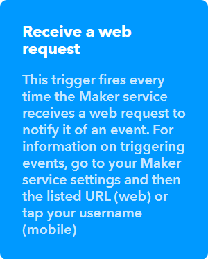
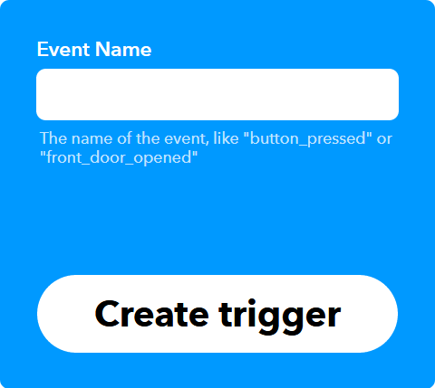
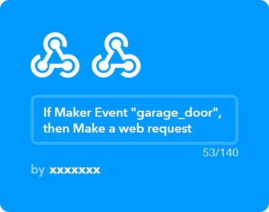
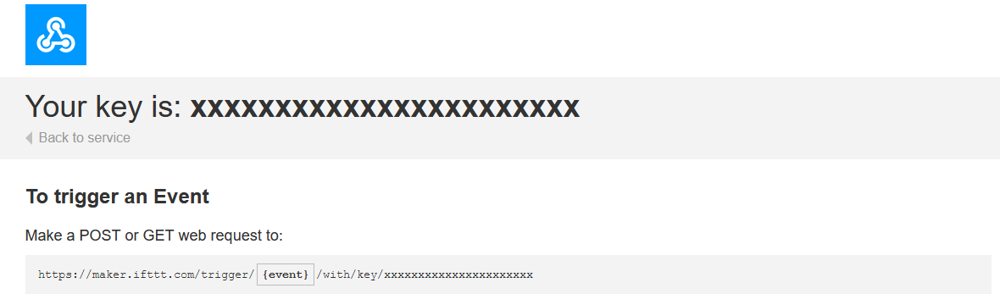
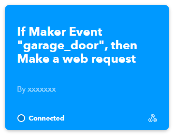

## IFTTT

IFTTT is an application that connects multiple services together.
With the help of IFTTT it is possible to automate various tasks from the watch, for instance smart home light, sending mails, opening the garage gate and much more.

An IFTTT event may trigger on any action that you specify. In our case it is going to be a signal coming from the watch you can activate by hand. The list of available services is shown at https://ifttt.com/services

1. Create an account on https://ifttt.com/join

2. Go to - https://ifttt.com/create/

3. Click `+This`, a new menu shall open. Type `webhooks` in the search bar. Click a tile 

Next, click 

4. The following window should open

Type in any name that comes to your mind, such as `garage_door` (do not use spaces though!). Remember that name.

5. Click `Create trigger`

6. Click `+That`

7. A new window will open. Here, you can select from a number of available services. In most cases, you would have to connect your IFTTT account to an account on external service. For instance: you can order pizza, open a phone app or send a HTTP request.

8. For demonstration, I made the simplest thing possible - a web request. 

You can access the list of active events at https://ifttt.com/my_applets

You can read more about webhooks at: https://help.ifttt.com/hc/en-us/articles/115010230347-Webhooks-service-FAQ

## Linking to the watch

### IFTTT

Go to https://ifttt.com/maker_webhooks/ and click `Documentation`

A new page will open. 

You need to copy the key or write it down on a paper so you can provide it later.

### Watch

Enter the watch config, click `configure` next to IFTTT in the section `apps`

Paste or type in the key from previous step in the text field next to the `key` field.

To add new actions, click `add new key`, the field to the left is a human - friendly name, such as `Garage door`. Next, fill the field to the right with the event name.

If you forget the name, go to https://ifttt.com/my_applets

 `garage_door` is the name you should provide.

