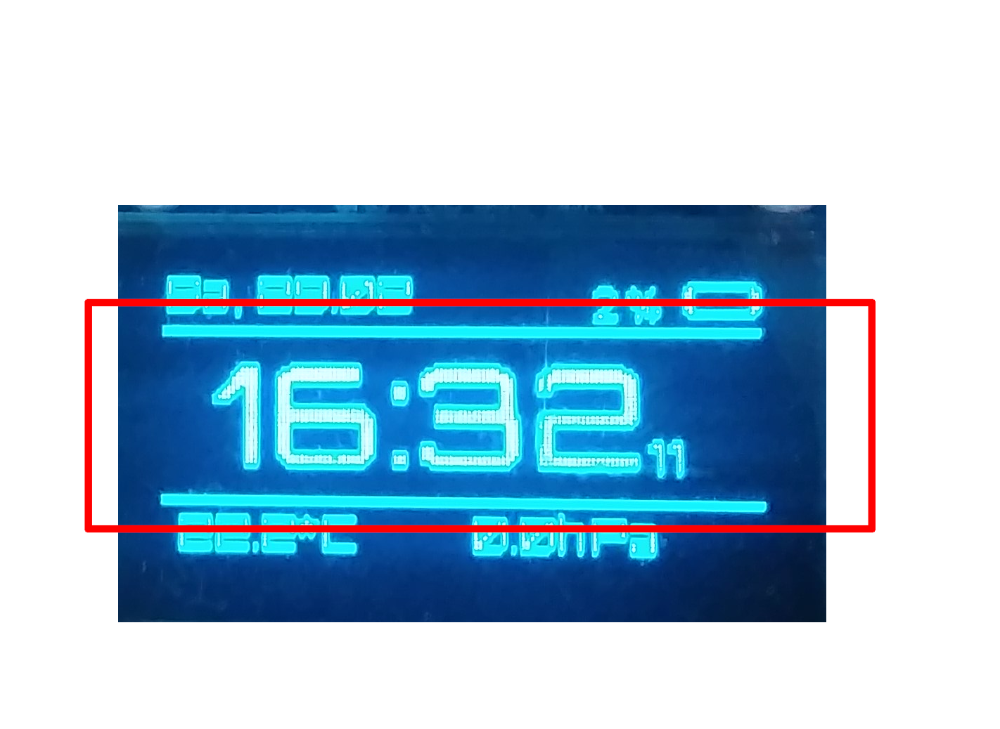
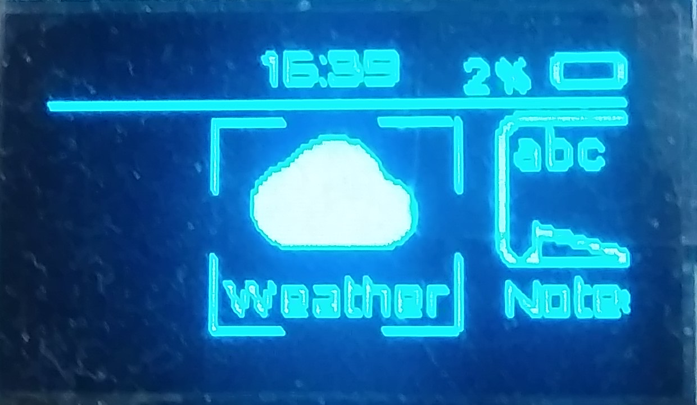
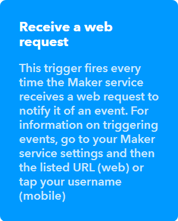
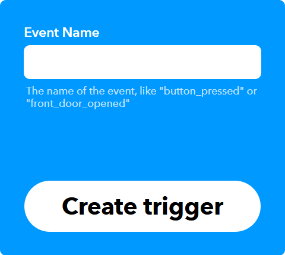
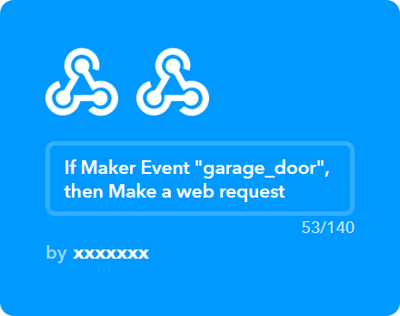
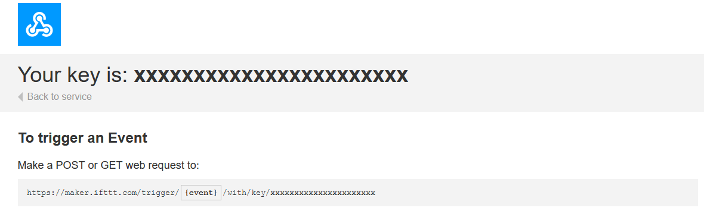
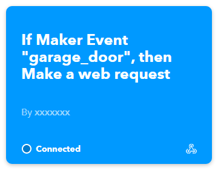

# Retro watch user guide

## Home screen

The home screen is divided into 3 horizontal sections. The upper part always stays visible, just like the notification bar in smartphones.

The middle section displays current time

The lower part displays misc data such as temperature and air pressure

## Navigation

There are only three buttons. 

Foto z zaznaczonymi strzałkami opisami przycisków

To select an option press the "Up" key for a little longer, we will refer to this as "OK". To go back to the previous screen or cancel, press "Down" for a little longer. This gesture is going to be refered to as "Back"

To make things more obvious - "Back" works just like the "back" button in the browser, while "Ok" works just like "Enter" on regular PCs.

The watch has two main views - you can change them by pressing either "Up" or "Down" from any of these views. 

On a `Home screen`, there are no interactive components.

On the second screen

There is a menu. To browse applications here press "Ok". Your press should be indicated by a long horizontal line at the bottom.

To go back to the home screen, press "Back" and "Down".

While having the menu selected, you can browse through the list of available apps. Use "Up" and "Down" buttons.

## Menu

### Weather
Given internet access, weather app can download the weather for your location.
When entering the app for the first time you will be asked to type in the name of your city. 
### Stopwatch

### Games

### IFTTT

IFTTT is an application that connects multiple services together.
With the help of IFTTT it is possible to automate various tasks from the watch, for instance smart home light, sending mails, opening the garage gate and much more.

An IFTTT event may trigger on any action that you specify. In our case it is going to be a signal coming from the watch you can activate by hand. The list of available services is shown at https://ifttt.com/services

1. Create an account on https://ifttt.com/join

2. Go to - https://ifttt.com/create/

3. Click `+This`, a new menu shall open. Type `webhooks` in the search bar. Click a tile 

Next, click 

4. The following window should open

Type in any name that comes to your mind, such as `garage_door` (do not use spaces though!). Remember that name.

5. Click `Create trigger`

6. Click `+That`

7. A new window will open. Here, you can select from a number of available services. In most cases, you would have to connect your IFTTT account to an account on external service. For instance: you can order pizza, open a phone app or send a HTTP request.

8. For demonstration, I made the simplest thing possible - a web request. 

You can access the list of active events at https://ifttt.com/my_applets

You can read more about webhooks at: https://help.ifttt.com/hc/en-us/articles/115010230347-Webhooks-service-FAQ

#### Linking to the watch

#### IFTTT

Go to https://ifttt.com/maker_webhooks/ and click `Documentation`

A new page will open. 

You need to copy the key or write it down on a paper so you can provide it later.

#### Watch

Enter the watch config, click `configure` next to IFTTT in the section `apps`

Paste or type in the key from previous step in the text field next to the `key` field.

To add new actions, click `add new key`, the field to the left is a human - friendly name, such as `Garage door`. Next, fill the field to the right with the event name.

If you forget the name, go to https://ifttt.com/my_applets

 `garage_door` is the name you should provide.

### Status

### WiFi

Establishing a connection with a WiFi network is important to let other functions work properly. There are two ways to connect

#### Using only the watch

1. Open WiFi from main menu.
2. Select "list networks" from the menu
3. Wait a moment while the scan is being done
4. Once networks are listed, scroll to network you want to connect to
5. Press "ok" (long press "up")
6. Use the built-in keyboard to provide the password.
7. If the password is correct, the watch would connect and save the credentials for later use.

#### With the help of settings

1. Open Settings from main menu
2. Select option "Settings, new network" - This will create a new WiFi network named "Watch". There is no password required to connect.
3. Find any other device such as a phone or laptop, connect to the newly created network ("Watch")
4. Open a web browser and navigate to webpage: 192.168.4.1
5. Wait a while. You will see a settings panel.
6. Click a huge button "Add a new network"
7. Provide name and password (just ignore the field "Automatic DHCP"). Click "Add".
8. You will see a new network added to the list. Everything is setup and ready. You can close the Settings by pressing "Back" on the watch (long press "down").

To test if network works:

1. Open WiFi from main menu.
2. Select "list networks" from the menu
3. Wait a moment while the scan is being done
4. Once networks are listed, scroll to network you want to connect to
5. Press "ok" (long press "up")

### Settings

## Web config